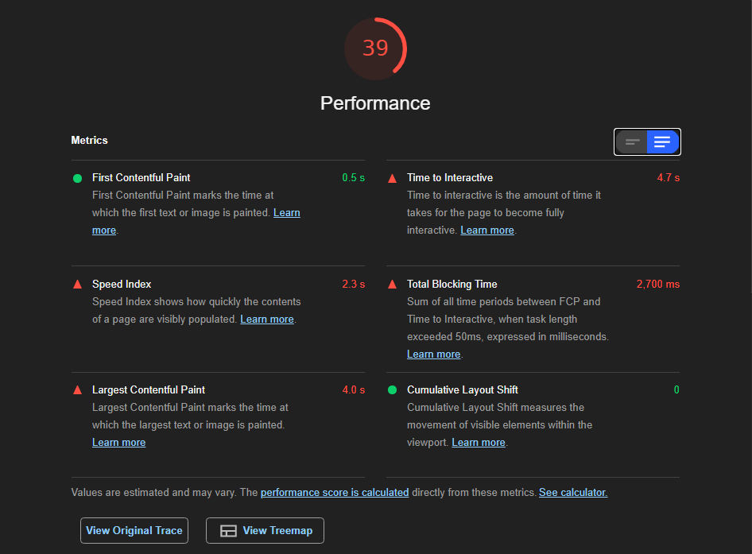
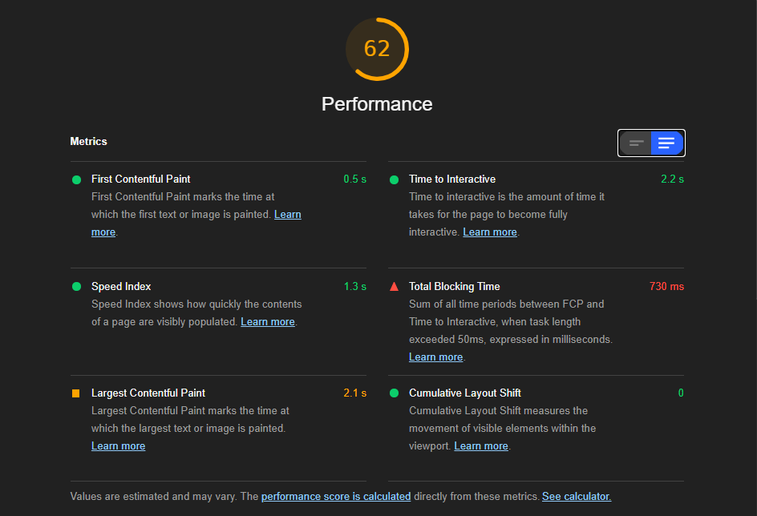

SQL Editor Mock Application for better interaction with SQL Databases. For Demo only.

The app was made using TypeScript and Next.js.

# Performance Optimizations
For the page Optimization, disabling SSR for the Code Editor Component and Lazy Loading the Code Editor Component showed significant improvement as follows.

| Measure | Without Optimization | With Optimization |
|---------|-------------------|----------------------|
| Time To Interactive | 4.7s | 2.2s |
| Speed Index | 2.3s | 1.3s |
| Total Blocking Time | 2700ms | 730ms |
| Largest Contentful Paint | 4.0s | 2.1s |
| Blocking Time due to Editor | 1780ms | 450ms |

## Without Optimization


## With Optimization


## Further possible Optimizations
The Monaco Editor fetches scripts from jsCDN for its usage, these scripts can be served locally which can further improve performance

To run the app locally:

1. Clone the repository

```bash
git clone https://github.com/prateekbose/sql-editor.git
```

2. Then run the development server:

```bash
npm run dev
# or
yarn dev
```

